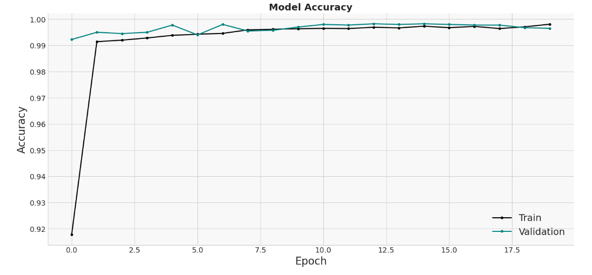
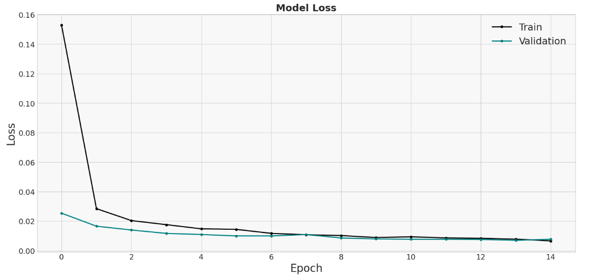
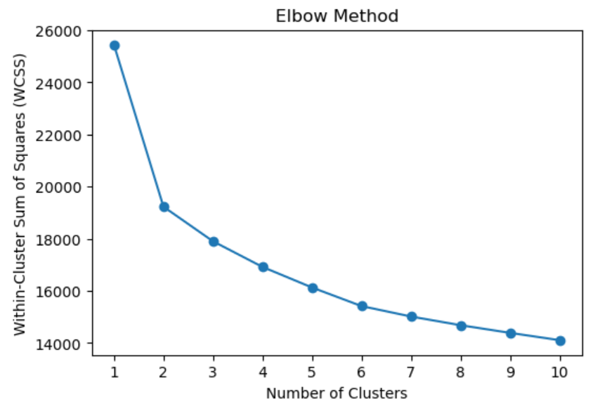
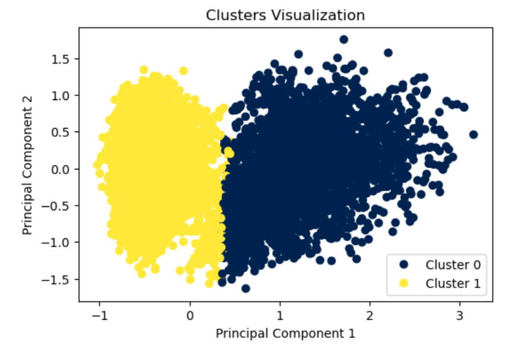
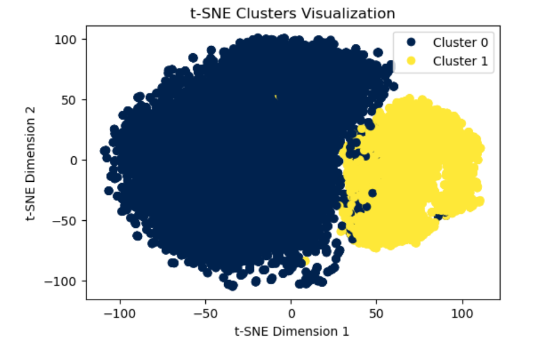
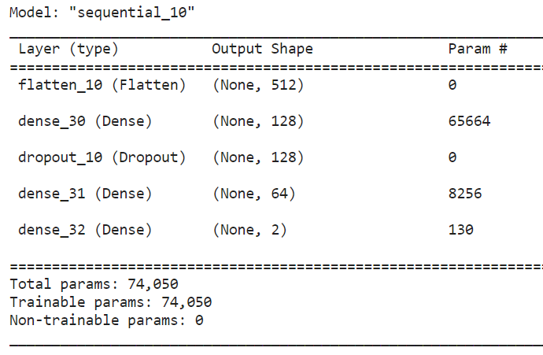
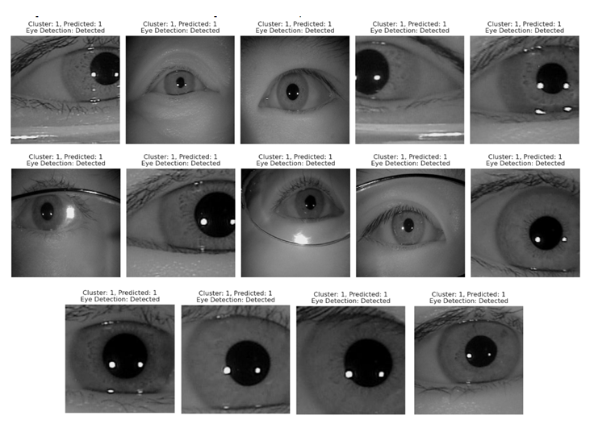
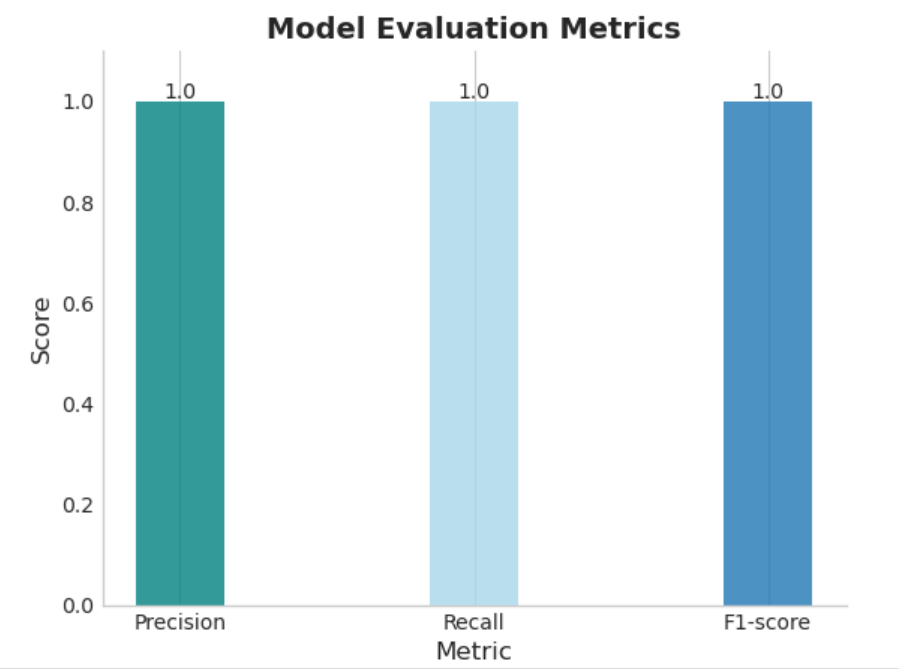

# IrisXplore_Clustering-Adventure
An innovative deep learning solution for iris recognition, synergizing feature extraction with advanced clustering techniques to enhance accuracy and performance.

## Table of Contents

- [Getting Started](#getting-started)
- [Dataset](#dataset)
- [Model Architecture](#model-architecture)
- [Usage](#usage)
- [Results](#results)
- [Contributing](#contributing)
- [License](#license)
- [Contact](#contact)
- [Acknowledgments](#acknowledgments)

## Getting Started

This project is implemented on Kaggle, a popular platform for data science and machine learning tasks. To interact with the code, follow the guidelines below:

### Prerequisites

- Create a Kaggle(https://www.kaggle.com/) account .
- Interactive code execution and exploration are possible with notebooks.


### Libraries Used

The project makes use of a number of powerful libraries, including:

- `tensorflow`: For building and training the deep learning model.
- `numpy`: For numerical operations.
- `sklearn`: For clustering (KMeans), dimensionality reduction (PCA), and manifold learning (TSNE).
- `matplotlib`: For data visualization and plotting.
- `tensorflow.keras.utils`: Specifically, the `to_categorical` function for one-hot encoding.

### Running the Code

- Once in the Kernel, you can run the code cells sequentially using the  "Run All" option to execute all cells.
- Kaggle provides an interactive environment, so you can modify the code and view the results in real-time.


## Dataset
The project uses the CASIA-Iris-Thousand(http://biometrics.idealtest.org/). Briefly describe the dataset, its structure, and its significance.

## Model Architecture

Our iris recognition model leverages a sequential architecture tailored for feature extraction and advanced clustering. Here's  the architecture:

### Network Structure:

1. **Flatten Layer**:
   - This layer reshapes the input into a 1D vector, ensuring compatibility with the subsequent dense layers.

2. **Dense Layer (128 Neurons)**:
   - This fully connected layer consists of 128 neurons and uses the ReLU (Rectified Linear Unit) activation function.
   - ReLU is applied element-wise, replacing any negative values with zeros. It introduces non-linearity to the model, enabling it to learn complex patterns.

3. **Dropout Layer (40% rate)**:
   - To prevent overfitting, we've introduced a dropout layer with a rate of 0.4, which means during training, approximately 40% of neurons in the preceding layer will be turned off at each step. This helps to improve generalization by ensuring the model doesn't rely too heavily on any individual neuron.

4. **Dense Layer (64 Neurons)**:
   - Another fully connected layer with 64 neurons, also utilizing the ReLU activation function.

5. **Output Layer**:
   - The final dense layer has a number of neurons corresponding to the number of clusters (`num_clusters`).
   - It uses the softmax activation function to produce probability distributions over the `num_clusters` classes.

### Model Compilation:

- **Loss Function**: The model employs `categorical_crossentropy` as the loss function, which is typically used for multi-class classification problems.
- **Optimizer**: The `adamax` optimizer is used for optimizing the model. It's a variant of the Adam optimization algorithm, specifically designed to have a more stable behavior in terms of convergence.
- **Metrics**: The model's performance is evaluated using accuracy as the primary metric.

### Training:

The model is trained over 20 epochs with a batch size of 64, using both training and validation datasets to monitor and validate its performance throughout the training process.

## Results

Our deep learning model for iris recognition, combined with clustering techniques, yielded significant insights and demonstrated notable performance. This section provides a visual summary of our results.

### Performance Metrics

Our model's performance was gauged across several epochs, revealing trends in accuracy and loss:

- **Accuracy Over Epochs**:
  Here's a visual representation of how the model's accuracy progressed over the epochs.
  

- **Loss Over Epochs**:
  The following graph demonstrates the model's loss trend across the epochs.
  

### Clustering Analysis

We used the KMeans algorithm for clustering and analyzed the optimal number of clusters:

- **Elbow Graph**:
  This graph helped determine the ideal number of clusters for KMeans by identifying the "elbow" point.
  

- **KMeans Clustering**:
  The visualization below showcases the data clustered using the KMeans algorithm.
  

- **t-SNE Clustering**:
  To further analyze our data's structure, we used t-SNE, which provided the following clustering visualization.
  

### Model Summary & Output

- **Model Architecture Summary**:
  The architecture and layers of our model are depicted below:
  

- **Model Output**:
  After training, our model was able to produce the following outputs:
  

### Additional Metrics

For a comprehensive understanding of the model's performance, we also reviewed various metrics:
  

```


